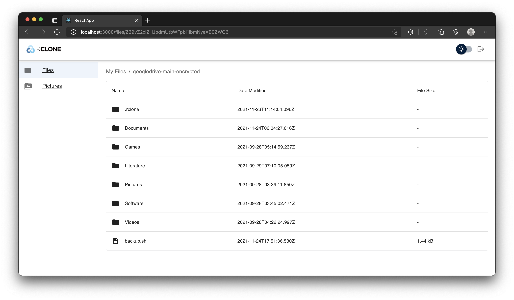

# RClone Drive Web UI

[](https://app.netlify.com/sites/silly-mirzakhani-2a7996/deploys) [](https://codecov.io/gh/EKarton/RClone-Drive-WebUI)

### Description:

The RClone Drive Web UI is a RClone client that provides an easy-to-use web interface to view and manage your files on RClone. It uses your RClone instance's [Remote Control](https://rclone.org/rc/) to connect to your cloud drives.

### Features:

- [x] Navigate and see files in directories and remotes
- [x] See images and files in detail
- [x] View and scroll through all pictures recursively (like Google Photos) with lazy-loading
- [x] Upload files and folders easily via drag-and-drop with web workers
- [x] Copy and move files between and within remotes asynchronously with web workers
- [x] Delete files asynchronously with web workers
- [x] Set theme to dark mode
- [x] Clear trash can on selected cloud providers and remotes
- [ ] Search for files and images across remotes

### Walkthrough:

Refer to [this doc](docs/Walkthrough.md) for a detailed walkthrough. However, here are a few screenshots:




### Setup / Getting Started:

1. Install dependencies by running `yarn install`
2. Start your RClone instance:

   1. If your RClone config is in its [default location](https://rclone.org/docs/#:~:text=The%20exact%20default%20is%20a%20bit%20complex%20to%20describe%2C%20due%20to%20changes%20introduced%20through%20different%20versions%20of%20rclone%20while%20preserving%20backwards%20compatibility%2C%20but%20in%20most%20cases%20it%20is%20as%20simple%20as%3A), run:

      ```
      rclone rcd --rc-allow-origin '*' --rc-user='local' --rc-pass="1234" --rc-serve
      ```

   2. Else, if it is in a different location, run:

      ```
      rclone rcd --rc-allow-origin '*' --rc-user='local' --rc-pass="1234" --rc-serve --config <Path to RClone config>
      ```

   More info is at the [RClone docs](https://rclone.org/commands/rclone_rcd/)

3. Run this app in development mode by running `yarn start-dev`. You can access your local build on http://localhost:3000 on your web browser.

### Useful Scripts for Local Development:

1. `yarn test`

   Runs all test cases

2. `yarn build`

   Builds the app in production mode

### Usage:

Please note that this project is used for educational purposes and is not intended to be used commercially. We are not liable for any damages/changes/lost data done by this project.

### Credits:

Emilio Kartono, who made the entire project. Illustrations are from https://undraw.co/.

### License:

This project is protected under the GNU licence. Please refer to the LICENSE.txt for more information.
