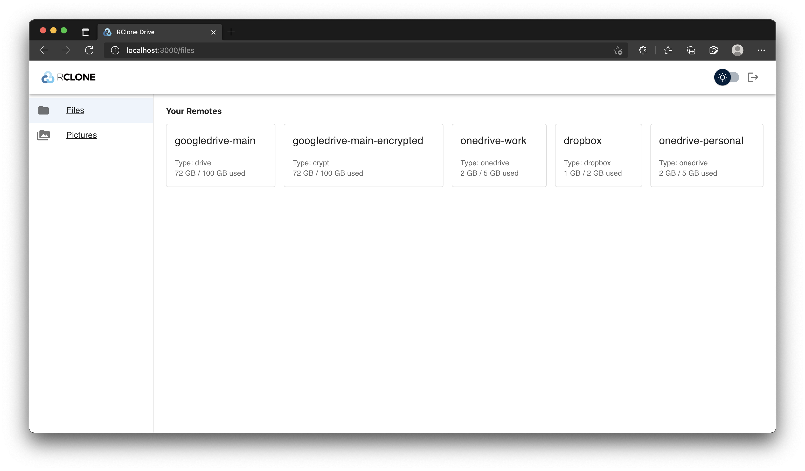
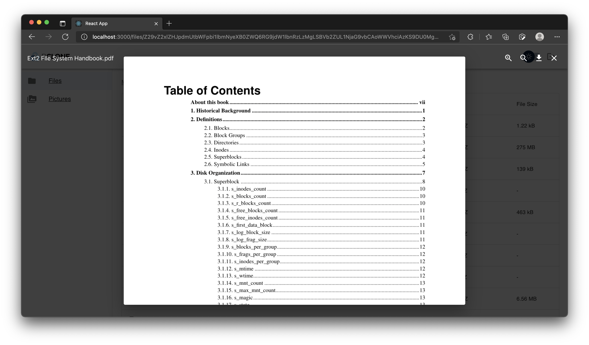
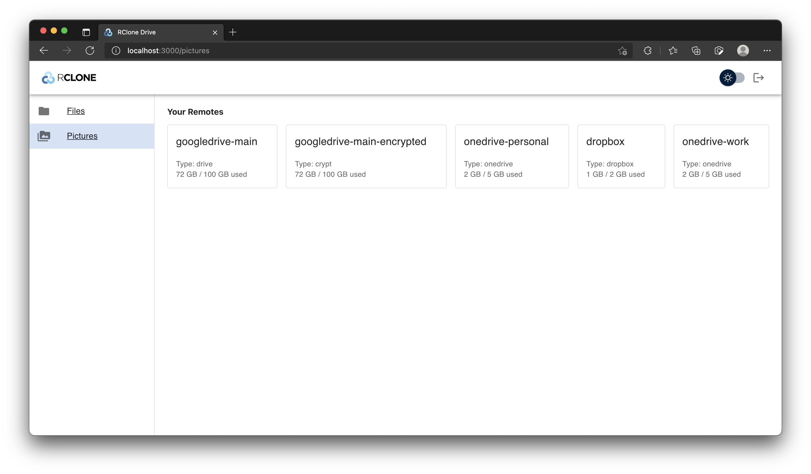
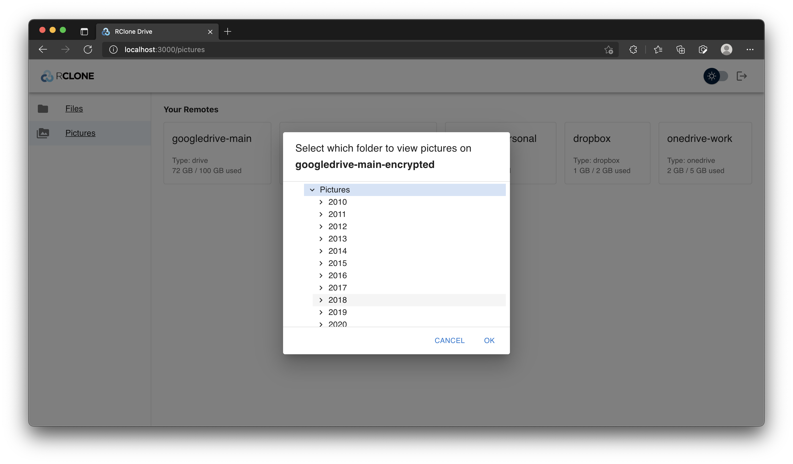
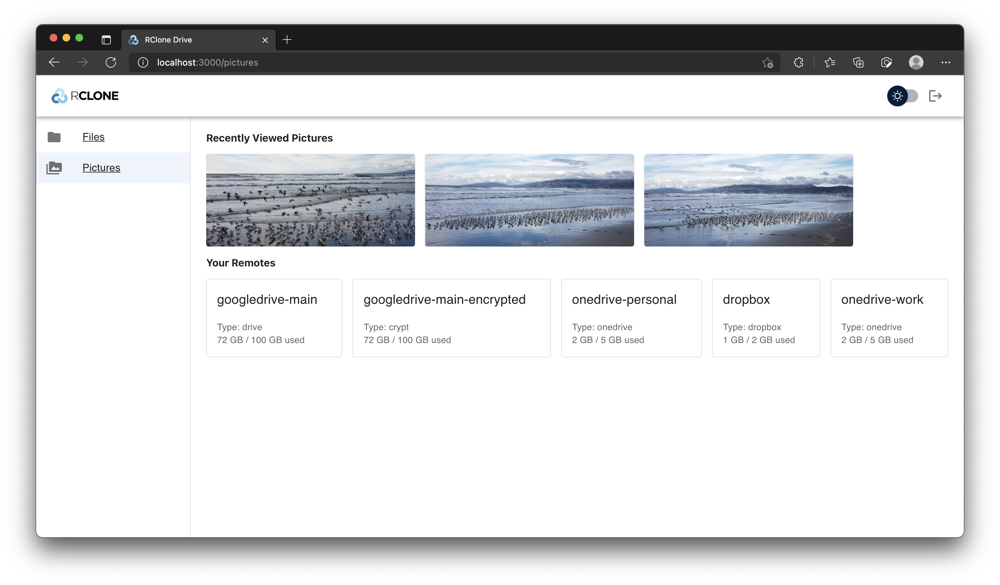

# RClone Drive Web UI

[](https://app.netlify.com/sites/silly-mirzakhani-2a7996/deploys)

### Description:

The RClone Drive Web UI is a RClone client that provides an easy-to-use web interface to view and manage your files on RClone. It uses your RClone instance's [Remote Control](https://rclone.org/rc/) to connect to your cloud drives.

### Features:

- [x] Navigate and see files in directories and remotes
- [x] See images and files in detail
- [x] View and scroll through all pictures recursively (like Google Photos) with lazy-loading
- [x] Upload files and folders easily via drag-and-drop
- [x] Copy and move files between and within remotes
- [x] Delete files
- [x] Set theme to dark mode
- [ ] Search for files and images across remotes

### Walkthrough:

Users will be using a front-end web application to view and manage their files on RClone. In the login page, they will need to specify the url of their RClone instance (usually it is http://localhost:5572), their username, and password:

<div width="100%">
   <p align="center">
      
   </p>
</div>

Once logged in, users are redirected to the files page with a list of their remotes:

<div width="100%">
   <p align="center">
      
   </p>
</div>

Clicking on a remote takes them to the files list page. Here, users are able to navigate into subfolders, view files, create new folders, copy existing content, upload files and folders, and delete files. Moreover, users are able to move files and folders between different remotes (ex: move files from Onedrive to Google Drive):

<table>
   <tr>
      <td>
         
      </td>
      <td>
         
      </td>
   </tr>
   <tr>
      <td>
         
      </td>
      <td>
         
      </td>
   </tr>
</table>

To view and scroll through pictures, users can click on the Files tab. Similar to the files page, users would need to pick a remote and a subfolder which contains their pictures:

<table>
   <tr>
      <td>
         
      </td>
      <td>
         
      </td>
   </tr>
</table>

After picking a folder, users can scroll through their pictures, and view pictures in detail:

<table>
   <tr>
      <td>
         
      </td>
      <td>
         
      </td>
   </tr>
</table>

Each time a picture is viewed, it gets added to a list of recently viewed pictures for future, easy access:

<div width="100%">
   <p align="center">
      
   </p>
</div>

### Setup / Getting Started:

1. Install dependencies by running `yarn install`
2. Start your RClone instance:

   1. If your RClone config is in its [default location](https://rclone.org/docs/#:~:text=The%20exact%20default%20is%20a%20bit%20complex%20to%20describe%2C%20due%20to%20changes%20introduced%20through%20different%20versions%20of%20rclone%20while%20preserving%20backwards%20compatibility%2C%20but%20in%20most%20cases%20it%20is%20as%20simple%20as%3A), run:

      ```
      rclone rcd --rc-allow-origin '*' --rc-user='local' --rc-pass="1234" --rc-serve
      ```

   2. Else, if it is in a different location, run:

      ```
      rclone rcd --rc-allow-origin '*' --rc-user='local' --rc-pass="1234" --rc-serve --config <Path to RClone config>
      ```

   More info is at the [RClone docs](https://rclone.org/commands/rclone_rcd/)

3. Run this app in development mode by running `yarn start-dev`. You can access your local build on http://localhost:3000 on your web browser.

### Useful Scripts for Local Development:

1. `yarn test`

   Runs all test cases

2. `yarn build`

   Builds the app in production mode

### Usage:

Please note that this project is used for educational purposes and is not intended to be used commercially. We are not liable for any damages/changes/lost data done by this project.

### Credits:

Emilio Kartono, who made the entire project

### License:

This project is protected under the GNU licence. Please refer to the LICENSE.txt for more information.
