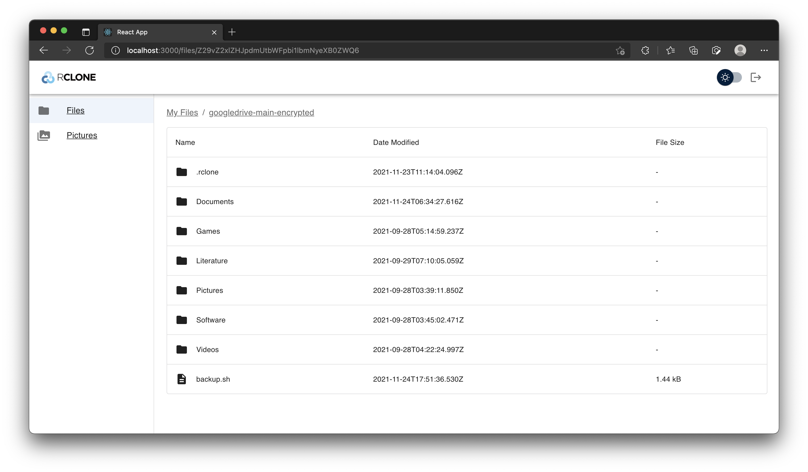

# Walkthrough of the Web App:

### Logging in:

Users will be using a front-end web application to view and manage their files on RClone. Before using the app, they would need to have RClone installed on their machines and run RClone in RCD mode. To set up RClone, users can follow [RClone's documentation](https://rclone.org/docs/). To run RClone in RCD mode, users can follow [this guide](https://rclone.org/commands/rclone_rcd/).

In the login page, they will need to specify the url of their RClone instance (usually it is http://localhost:5572), their username, and password:

### Files Tab:

Once logged in, users are redirected to the files page with a list of their remotes:

Clicking on a remote takes them to the files list page:

Here, users are able to navigate into subfolders, create new folders, copy existing content, upload files and folders, and delete files:

Users can also view files in detail:

### Pictures

To view and scroll through pictures, users need to click on the Pictures tab. After clicking on the Pictures tab, they will need to pick a remote, and a subfolder in that remote containing their photos:

Now, users can scroll to quickly view their list of photos. It displays all photos recursively:

Technical note: it won't load all images in the browser; it only displays the images that are viewable on the viewport. Moreover, it also caches viewed images. This ensures smoother scrolling experience and less bandwidth used.

Clicking on a picture views the pictures in detail:

Each time a picture is viewed in detail, it gets added to a list of recently viewed pictures for future, easy access:

